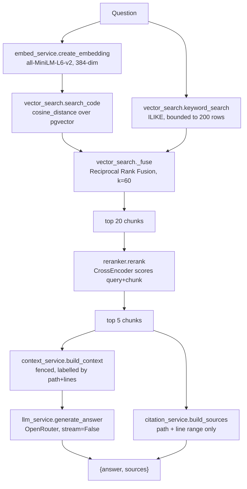

# codebase-rag

Ask questions about a git repository and get answers cited back to the exact
file and line range that supports them.

Point it at a public GitHub URL. It clones the repo, strips out lockfiles and
generated noise, splits the real source into chunks, embeds each chunk with
path and symbol context, stores the vectors in Postgres/pgvector, and then
answers questions by hybrid-retrieving chunks, reranking them, and asking an
LLM to answer using only what it was given. Every claim comes back with a
clickable citation you can expand into the real code.

- **Backend** — FastAPI, SQLModel, pgvector, Alembic
- **Frontend** — React + TypeScript + Vite + Tailwind
- **Models** — `all-MiniLM-L6-v2` (embeddings) and
  `cross-encoder/ms-marco-MiniLM-L-6-v2` (reranking), both local via
  sentence-transformers. Only the final answer is a remote call, to OpenRouter.
- **Storage** — one git clone per repository under `data/repositories/`, plus
  chunk rows in Postgres. Both are reclaimed on idle.

---

## Contents

- [What it does](#what-it-does)
- [How a question is answered](#how-a-question-is-answered)
- [How a repository is indexed](#how-a-repository-is-indexed)
- [Quickstart](#quickstart)
- [Project layout](#project-layout)
- [Data model](#data-model)
- [API reference](#api-reference)
- [Retrieval design](#retrieval-design)
- [Idle expiry](#idle-expiry)
- [Configuration](#configuration)
- [Frontend](#frontend)
- [Testing](#testing)
- [Known limitations](#known-limitations)

---

## What it does

The app has three user-facing surfaces, all in `frontend/src`:

1. **Connect** — paste a GitHub URL (`ConnectForm.tsx`). The app creates the
   repository, clones it, indexes it, and shows staged progress
   (`IngestProgress.tsx`).
2. **History** — every repository you have added, with chunk count and time
   remaining before it is reclaimed (`RepositoryHistory.tsx`).
3. **Ask** — a chat panel (`ChatPanel.tsx`, `useChat.ts`). Answers render as
   markdown, and each citation expands into the real file contents with the
   cited lines highlighted (`SourceCard.tsx`, `CodeBlock.tsx`).

A repository occupies real disk and real database space, so unused ones are
deleted automatically after an idle window. The UI always shows the remaining
time.

---

## How a question is answered

`GET /repositories/search?query=...&repository_id=...` is one request that runs
five stages. This is the single most useful thing to understand about the
codebase, so it is worth reading end to end.



| Stage | File | What happens |
| --- | --- | --- |
| 1. Embed the query | `services/embedding_service.py` | The question becomes one 384-dim vector. Note this is the **bare question** — no path or symbol decoration, which only chunks get. |
| 2. Two searches | `services/vector_search.py` | `search_code` orders chunks by `cosine_distance`. `keyword_search` does a bounded `ILIKE` and ranks in Python. |
| 3. Fuse | `services/vector_search.py` | Both ranked lists are over-fetched and merged with Reciprocal Rank Fusion, so a chunk found by either signal can win. |
| 4. Rerank | `services/reranker.py` | A CrossEncoder scores each of the 20 candidates against the query and keeps the best 5. This is what removes "topically similar but wrong" chunks. |
| 5. Answer | `services/context_service.py`, `services/llm_service.py`, `services/citation_service.py` | The 5 chunks are formatted into one prompt, sent to OpenRouter, and the same 5 chunks become the citations. |

Two invariants worth knowing, because both were bugs once:

- **Citations are built from the post-rerank list**, never the retrieval pool.
  `build_sources` must only receive chunks that actually reached the prompt,
  otherwise the UI credits the model with passages it never saw.
- **The LLM is told to refuse.** The system prompt is "answer using only the
  provided code context; if the answer is not present, say you don't know."
  There is no retrieval fallback, so a bad retrieval is visible as a wrong or
  empty answer rather than a plausible invention.

Defaults are threaded as explicit arguments rather than module constants:
`rag_service.ask_repository` uses `top_k=20`, `rerank_top_k=5`, and
`build_context` caps at `max_chunks=5`.

---

## How a repository is indexed

Ingestion is deliberately split into a cheap half and an expensive half. The
frontend calls them in order.

| Step | Call | Cost | Result |
| --- | --- | --- | --- |
| 1. Register | `POST /repositories/?url=...` | instant | Row created, status `pending`. Idempotent: a known URL returns the existing row instead of a duplicate. |
| 2. Clone | `GET /repositories/{id}/ingest` | seconds | `git clone` into `data/repositories/{id}/`. Status stays `processing`. |
| 3. Index | `GET /repositories/{id}/files` | the slow one | Filter → chunk → embed → store. Status becomes `completed`. |

Inside step 3:

1. **`code_parser.get_cleaned_files`** walks the clone and drops lockfiles,
   generated manifests, minified output, source maps, bundles, binaries, and
   anything over `MAX_FILE_SIZE_MB`. Language comes from a Pygments lexer.
2. **`code_chunker.chunk_code`** splits each file with
   `langchain-text-splitters`, keeping `start_line`/`end_line` so citations can
   point at real coordinates.
3. **`embedding_service.embeddable_text`** builds the text actually embedded:
   the repo-relative path, the symbols the chunk defines, then the code. The
   stored `content` stays verbatim.
4. **`symbols.extract_symbols`** pulls definition names out of the chunk, so
   "where is X defined" ranks the chunk that *defines* X above chunks that
   merely call it.
5. **`vector_storage.store_chunks`** deletes any existing chunks for the
   repository before inserting, so re-indexing replaces rather than appends.

### Status is a state machine, and it is only set honestly

```
pending ──ingest──> processing ──index ok──> completed
                        │
                        └──any exception──> failed
```

- `processing` is **not** `completed`. Claiming success at clone time is what
  made a failed index look like a successful one.
- A run that dies mid-index leaves `processing` behind with nobody to finish
  it. `repository.is_abandoned_processing` treats `updated_at` older than
  `PROCESSING_STALE_AFTER` (30 minutes) as abandoned, so indexing can be
  retried. A live run is rejected with `400`.
- Indexing with zero indexable files is an error, not a success. Otherwise
  `os.walk` over the wrong directory yields nothing and the run "completes"
  with an empty index.
- `GET /repositories/{id}/files` returns `409` if the repo was never cloned,
  rather than silently producing an empty index.

### A known wart: indexing is a `GET`

`GET /repositories/{id}/files` mutates state, creates ~300 rows, and can run
for minutes. That is not RESTful and it will bite you if a crawler or a
prefetch ever hits it. Changing the verb means changing the API and the
frontend together, so it has not been done — see [Known limitations](#known-limitations).

The frontend is written to be tolerant of either shape: `api.indexRepository`
tries `POST /repositories/{id}/index` first and falls back to the `GET`. The
same pattern applies to cloning and asking.

---

## Quickstart

Requirements: Python 3.14, Node 20+, PostgreSQL 15 (Homebrew), and an
OpenRouter API key.

```bash
git clone <this repo> && cd codebase-rag
cp .env.example .env
```

Then edit `.env` and set the two required values:

```bash
OPENROUTER_API_KEY=rk-...          # required
LLM_MODEL=nvidia/nemotron-3-ultra-550b-a55b:free   # required, any OpenRouter model id
```

`LLM_MODEL` has no default on purpose — a silent default would send your
questions to a model you did not choose.

```bash
./scripts/dev.sh start     # postgres + migrations + backend + frontend
./scripts/dev.sh status
./scripts/dev.sh stop
```

Then open <http://localhost:5173>.

`dev.sh` provisions the venv, starts `postgresql@15` on **port 5434** with the
`vector` extension enabled, runs `alembic upgrade head`, and launches Uvicorn
on **8001** and Vite on **5173**. Port 5434 rather than 5432 because that is
the brew formula shipping pgvector, leaving 5432 to any other Postgres on the
machine.

First start downloads both models (~90 MB each) into `~/.cache/huggingface`, so
the first request is slow while the backend warms up.

---

## Project layout

```
app/
  main.py                    FastAPI app, CORS, lifespan + cleanup loop, /health
  config.py                  Settings from .env (pydantic-settings)
  db/db.py                   engine, session, get_session dependency
  api/repository_api.py      every HTTP route
  models/
    repository.py            Repository + RepositoryStatus
    code_chunk.py            CodeChunk + Vector(384) + ON DELETE CASCADE
  representations/
    repository.py            API response shape, incl. expires_at
  services/
    repository.py            ingestion lifecycle, file preview, status rules
    cleanup.py               expiry selection + deletion (advisory-locked)
    cleanup_runner.py        startup sweep + interval loop
    code_parser.py           which files are worth indexing
    code_chunker.py          file -> overlapping chunks with line numbers
    symbols.py               definition-name extraction
    embedding_service.py     the embedder + embeddable_text
    vector_storage.py        replace-then-insert chunk persistence
    vector_search.py         vector + keyword search, RRF fusion
    retrieval_service.py     search -> normalised dicts for the pipeline
    reranker.py              CrossEncoder reranking
    context_service.py       chunks -> prompt text
    llm_service.py           OpenRouter answer generation
    citation_service.py      chunks -> citation dicts
    paths.py                 the one place that knows the storage layout
alembic/versions/            3 migrations
scripts/dev.sh               local postgres + backend + frontend
tests/                       76 tests across 11 files
frontend/src/
  App.tsx                    routing between landing, ask, history
  hooks/useRepository.ts     connect / restore / open state machine
  hooks/useChat.ts           ask, retry, stage ticker
  hooks/useTheme.ts          light/dark
  lib/api.ts                 typed client; tries POST then falls back to GET
  lib/http.ts                fetch wrapper, ApiError, timeouts
  lib/env.ts                 VITE_API_BASE_URL resolved once
  components/                19 presentational components
  types/api.ts               frontend mirrors the API contract
```

---

## Data model

Two tables. `alembic upgrade head` creates both.

### `repositories`

| Column | Type | Notes |
| --- | --- | --- |
| `id` | int PK | |
| `name`, `url` | str | `name` is the last URL segment |
| `status` | enum | `pending` / `processing` / `completed` / `failed` |
| `created_at`, `updated_at` | timestamptz | `updated_at` tracks indexing state |
| `last_accessed_at` | timestamptz, **indexed** | Drives idle expiry. Separate from `updated_at` on purpose — otherwise a half-finished index would look recently used. |

### `code_chunks`

| Column | Type | Notes |
| --- | --- | --- |
| `id` | int PK | |
| `repository_id` | int FK | `ON DELETE CASCADE`, indexed. Had no constraint at all, so deleting a repository used to orphan every chunk permanently. |
| `file_path`, `file_name`, `language` | str | Repo-relative path |
| `chunk_index` | int | Position within the file |
| `content` | text | Verbatim source, byte for byte what a citation shows |
| `start_line`, `end_line` | int | 1-indexed, inclusive |
| `embedding` | `vector(384)` | `all-MiniLM-L6-v2`, L2-normalised. ~74% of a chunk row in practice. |

There is **no** stored `embeddable_text` column. The path and symbol header is
built at index time and thrown away after embedding; `content` is what gets
persisted and shown.

---

## API reference

All routes are on `app/api/repository_api.py`.

| Method | Path | Purpose |
| --- | --- | --- |
| `GET` | `/health` | Liveness. Used by the frontend connection banner. |
| `POST` | `/repositories/?url=<github url>` | Register. Idempotent per URL. 400 on a non-GitHub URL. |
| `GET` | `/repositories/` | History list, newest first, with chunk counts. **Does not count as use** (see [Idle expiry](#idle-expiry)). |
| `GET` | `/repositories/{id}/ingest` | Clone. Idempotent. 400 if already processing, 404 unknown. |
| `GET` | `/repositories/{id}/files` | Parse, chunk, embed, store. 409 if not cloned, 500 on failure. |
| `GET` | `/repositories/{id}/files/{file_path}` | File preview for citations. 400 if the path escapes the clone, 404 missing, 413 over 1 MB, 415 non-UTF-8. |
| `GET` | `/repositories/search?query=&repository_id=` | Ask a question. `repository_id` is optional; omit it to search every repository. |

Two shapes the backend does **not** implement, which the frontend probes for
and falls back from: `GET /repositories/{id}` (falls back to scanning the
list) and `POST /repositories/{id}/ask` (falls back to `/search`). They are
attempted first so a future REST-shaped backend would be picked up
automatically.

`{file_path:path}` is path-constrained, not just quoted:
`repository.resolve_repository_file` resolves the requested path and rejects
anything not inside the repository root, so `/etc/passwd` and `../../.env` are
unreachable. It also accepts the legacy `data/repositories/{id}/...` form.

---

## Retrieval design

Two things dominated answer quality, and both were wrong in the first version.

**Generated files were being indexed.** A 26,000-line `package-lock.json`
produced roughly 850 of a 915-chunk index, so most "sources" the model saw were
lockfile noise. `code_parser.is_ignored` now skips lockfiles, generated
manifests, minified output, source maps, and bundles. The same repository went
from 915 chunks to 62.

**Hybrid search was not hybrid.** `hybrid_search` ran the vector search,
appended the keyword results, and truncated to `top_k` — so the keyword half
was dead code that only ever appeared if the vector search returned fewer than
`top_k` rows. It also had two bugs underneath: `repository_id == None`
compiles to `IS NULL` and matched no repository, and an unescaped `%` in a
query acted as a SQL wildcard.

Both halves now feed a Reciprocal Rank Fusion over over-fetched candidate pools
(`top_k * candidates_per_list`, default 4x), so a chunk ranked well by either
signal can surface, and a chunk found by both is promoted above one found by a
single method. RRF is rank-based, so it does not need a cosine distance and a
keyword hit to be on the same scale.

Keyword results are ranked in Python, not SQL. "Position of substring" has no
portable spelling: PostgreSQL has `strpos`, SQLite has `instr`, and PostgreSQL
has no `instr`. Ranking in SQL meant a function that broke whichever database
the other tests ran on. The fetch is bounded to
`KEYWORD_CANDIDATE_LIMIT` (200) so it cannot become a full table scan.

**Embeddings carry path and symbol context.** `embeddable_text` prefixes the
repository-relative path and any definition names found by
`symbols.extract_symbols` ahead of the code, while the chunk text stored and
cited stays byte-for-byte what the user will read. Asking "where is the puter
provider defined?" now ranks `backend/app/providers/puter.py` first, which the
code text alone did not convey.

`extract_symbols` matches on definition keywords behind a modifier prefix, so
`export class Widget` and `public void main` are both caught. An earlier
keyword pre-filter was removed: it silently skipped every arrow function, since
`const x = () => {}` contains none of the definition keywords. Ten cheap regexes
per line is a fine price for not dropping real symbols.

### The two models

| Role | Model | Size | Where |
| --- | --- | --- | --- |
| Embedding | `all-MiniLM-L6-v2` | 22.7M params, 384-dim, ~87 MB | `embedding_service.py` |
| Reranking | `cross-encoder/ms-marco-MiniLM-L-6-v2` | ~90 MB | `reranker.py` |

Both are loaded eagerly at **import** time as module-level singletons, which is
why the first request after a restart is slow. Together with `import torch`
they account for roughly 450 MB of resident memory — the model weights are
only ~87 MB of that; the rest is PyTorch itself. Both are pinned in
`requirements.txt` via `sentence-transformers`.

The reranker matters more than its size suggests. Cosine similarity finds
chunks that are topically near the question; the CrossEncoder scores the
*pair* of question and chunk together, which is what actually separates
"mentions the same words" from "answers the question". Cutting 20 candidates
to 5 is where most of the precision comes from.

---

## Idle expiry

A repository occupies space in two places: a git clone under
`data/repositories/{id}/`, and one `code_chunks` row per chunk, of which the
`Vector(384)` embedding is the largest part (74% of a chunk row in practice).
A background sweep deletes both once a repository goes unused.

Expiry is keyed on `last_accessed_at`, not `created_at`. A hard age limit would
delete a repository you are actively working in, so "used" means indexed,
previewed, searched, or created.

One deliberate exception: **`GET /repositories/` does not count as use.** The
frontend loads that history list on every page render, so treating it as use
would refresh every repository forever and nothing would ever be reclaimed. A
cross-repository `/search` without `repository_id` likewise touches nothing, or
every keystroke would wake every stored repository.

The sweep runs once at startup, to catch repositories that expired while the
process was down, and then on an interval. It is serialized with a Postgres
advisory lock (`cleanup_lock`), so running several uvicorn workers cannot have
them race over the same rows. It runs in a thread via `asyncio.to_thread` so
the event loop keeps serving requests.

Three details that are load-bearing:

- **`code_chunks.repository_id` has an `ON DELETE CASCADE` foreign key.** It had
  no constraint at all, so deleting a repository orphaned its chunks
  permanently — unreachable, never reclaimed. The migration purges existing
  orphans before adding the constraint.
- **The clone is deleted before the database rows.** If `rmtree` fails the rows
  survive and the next sweep retries; the reverse order would strand data that
  nothing points at.
- **Repositories with status `processing` are never swept.** A live index has
  open handles into its own clone and an open transaction against its own rows.

`cleanup_runner` is wired into the FastAPI lifespan and cancelled cleanly on
shutdown. Because the root logger is otherwise unconfigured, `main.py` calls
`logging.basicConfig` explicitly — the sweeper deletes user data with no UI
trace, so the log line is the only record that a repository was reclaimed.

The history list shows each repository's remaining time
(`286 chunks · added today · expires in 10h`), and the deadline is computed
server-side as `last_accessed_at + TTL` so the UI never hardcodes a retention
window. A repository past its deadline reads `expiring soon` in the warning
colour, because the sweeper runs on an interval and so there is a lag between
becoming eligible and being removed. When `REPO_CLEANUP_ENABLED=false` the
backend sends no deadline at all rather than counting down to something that
will never happen.

`DELETE` frees space for Postgres to reuse, not for the OS. Reclaiming actual
free space needs `VACUUM`, which takes an exclusive lock, so it belongs in a
manual maintenance step rather than the background sweep.

---

## Configuration

Everything is read from `.env` by `pydantic-settings`. See `.env.example`.

| Variable | Required | Default | Meaning |
| --- | --- | --- | --- |
| `DATABASE_URL` | yes | — | SQLAlchemy URL. Must point at Postgres with the `vector` extension. |
| `OPENROUTER_API_KEY` | yes | — | Only needed to generate answers. Indexing and search work without it. |
| `LLM_MODEL` | yes | — | OpenRouter model id. No default, on purpose. |
| `MAX_FILE_SIZE_MB` | no | `1` | Files larger than this are skipped during indexing. |
| `CORS_ORIGINS` | no | `http://localhost:5173,http://127.0.0.1:5173` | Comma-separated allowed origins. |
| `REPO_IDLE_TTL_HOURS` | no | `12` | Idle time before a repository is dropped. |
| `REPO_CLEANUP_INTERVAL_MINUTES` | no | `15` | How often the sweeper runs, and the worst-case delay before a newly-expired repository is reclaimed. |
| `REPO_CLEANUP_ENABLED` | no | `true` | Set false to disable expiry entirely. |

Frontend configuration is separate and prefixed `VITE_`:

| Variable | Default | Meaning |
| --- | --- | --- |
| `VITE_API_BASE_URL` | `http://localhost:8000` | Backend base URL, resolved exactly once in `lib/env.ts`. Local `.env` points it at `:8001` to match `dev.sh`. |

`frontend/.env` is gitignored because it is machine-specific. Copy
`frontend/.env.example` if you need to change it.

---

## Frontend

The UI owns **no RAG logic**. Cloning, filtering, chunking, embedding, search,
reranking, context building, generation, and expiry all happen server-side; the
frontend is a thin, typed client. See `frontend/README.md` for the component
tour.

Two things are worth knowing if you are changing it:

- **The API client is deliberately shape-tolerant.** `requestAny` in
  `lib/api.ts` tries a REST-shaped call first (`POST .../ask`,
  `POST .../index`) and falls back to the legacy `GET` the backend actually
  serves. If you clean up the verbs on the backend, the client still works and
  you can delete the fallbacks.
- **Timeouts are split deliberately.** `REQUEST_TIMEOUT_MS` is 30s for chat,
  but `INGEST_TIMEOUT_MS` is 15 minutes, because indexing a whole repository
  is a single long request. Both live in `lib/env.ts`.

---

## Testing

```bash
./venv/bin/python -m pytest tests/ -q      # 76 tests
cd frontend && npm run typecheck           # tsc, no emit
cd frontend && npm run build               # tsc -b && vite build
```

| File | Covers |
| --- | --- |
| `test_retrieval_quality.py` | LIKE escaping, unfiltered search, RRF, symbol extraction, path handling |
| `test_cleanup.py` | Expiry selection, the `processing` guard, directory-before-rows ordering, retry after a failed removal, the history list not counting as use, `expires_at` reporting |
| `test_rag_pipeline.py` | Stage ordering, and that citations come from the reranked set |
| `test_retrieval.py` | Retrieval service normalisation |
| `test_citation.py` | Citation dedup and shape |
| `test_context.py` | Prompt assembly |
| `test_embeddings.py` | `embeddable_text` header construction |
| `test_code_parser.py` | Ignore rules, binary detection, size limits |
| `test_code_chunker.py` | Chunk boundaries and line numbers |
| `test_paths.py` | Storage-prefix stripping and idempotence |
| `test_repository_lifecycle.py` | Status transitions, stale `processing`, 409-before-clone |
| `conftest.py` | SQLite fixtures — note keyword ranking runs on both engines for exactly the portability reason above |

---

## Known limitations

Deliberate, and not yet fixed:

- **Indexing runs on a `GET`** (`GET /repositories/{id}/files`). Mutates state,
  can run for minutes, and a crawler could trigger it. The fix is a verb change
  across the API and the frontend together; the client already prefers the
  correct shape.
- **No authentication or multi-user support.** Anyone who can reach the API can
  read, index, and delete repositories. `allow_credentials` is `False` and CORS
  is origin-restricted, which is not access control.
- **No rate limiting or request size limits** beyond the 1 MB file preview cap.
- **`git clone` runs as a blocking subprocess** with no timeout and no depth
  limit, so a very large repository can hold a worker for a long time. Only
  public GitHub URLs are accepted, validated by regex in
  `repository.is_valid_github_url`.
- **Re-indexing does not fetch updates.** `sub_process_repository` skips the
  clone if `.git` exists, so re-indexing a stale clone re-embeds the old
  contents. There is no `git pull`.
- **Expiry has no manual override.** There is no `DELETE /repositories/{id}`
  route, so a repository can only be removed by waiting for the sweeper.
- **No `VACUUM` automation**, so deleted space is returned to Postgres but not
  to the OS.
- **Docker path is unverified.** A `Dockerfile` and `docker-compose.yml` exist
  but have never been built; local Docker was abandoned in favour of
  `scripts/dev.sh`. Treat them as unmaintained.
